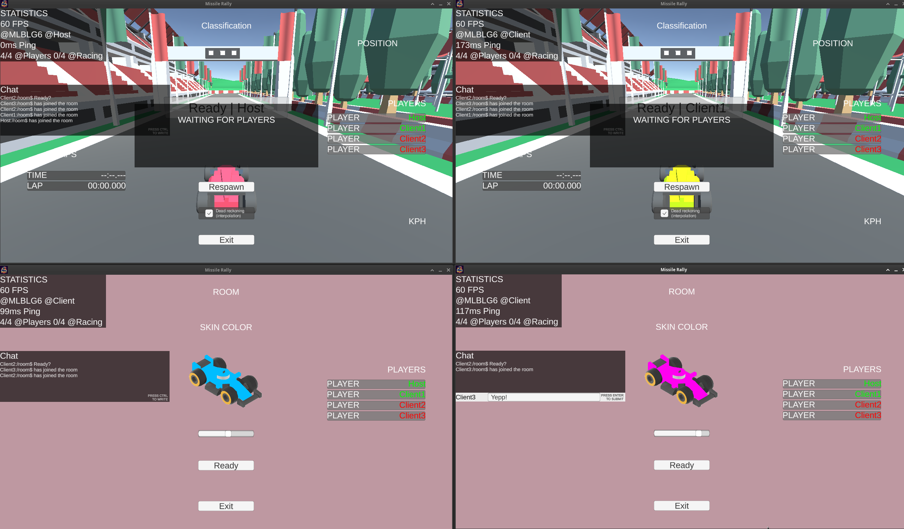
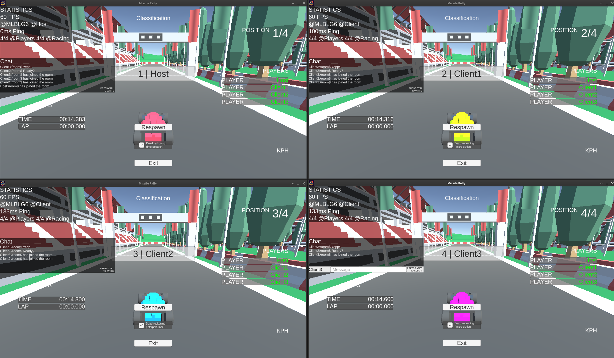
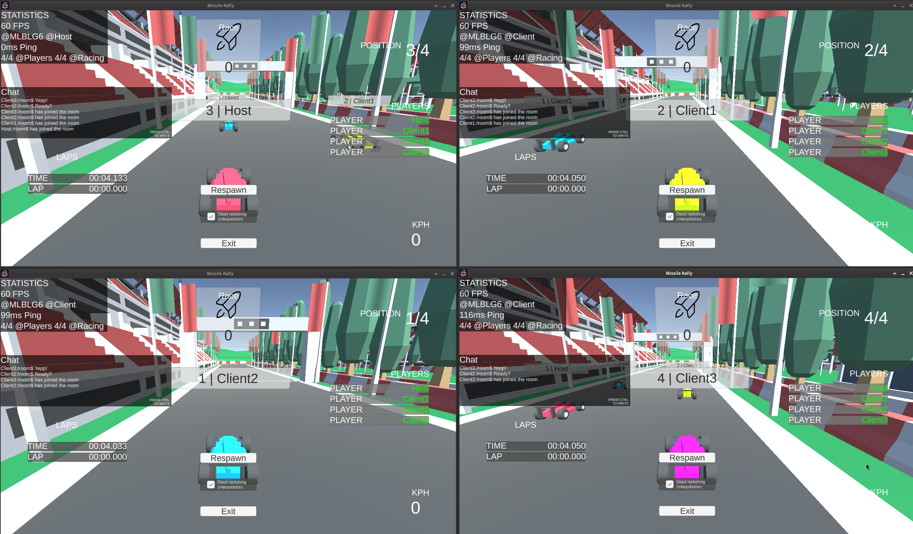
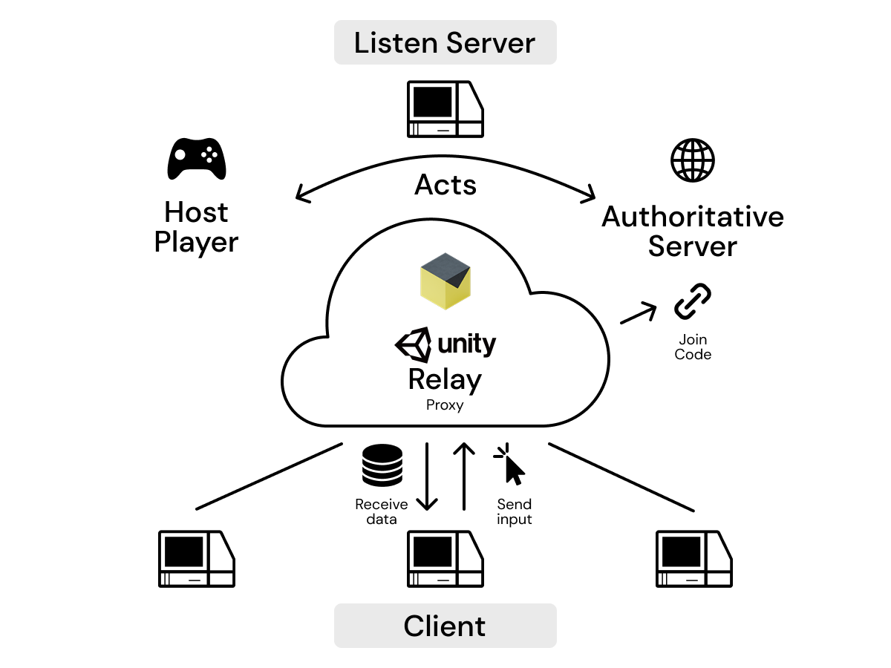

# Unity Multiplayer Racing Videogame

## Implementation of concurrent videogame listen server architecture and centralized control architecture using Relay with Netcode for GameObjects framework

## Table of contents

1. **[Authorship](#1-Authorship)**
2. **[Description](#2-Description)**
3. **[Architecture and technology diagram](#3-Architecture-and-technology-diagram)**

## 1 Authorship

    Original publish date: April, 2024
    License: MIT
    Author: Alejandro Asensio Pérez

> **Disclaimer:** This work was created as part of my academic coursework at King Juan Carlos University. While I claim copyright for the selection and arrangement of the content, the copyright for the original materials used in this work is held by the university and the instructor, Julio Guillén.

## 2 Description

This Unity project showcases concurrent programming to achieve a smooth and engaging experience. It utilizes a listen server architecture with centralized control for efficient gameplay coordination. Additionally, techniques like Dead Reckoning (predicting player movement) and Rubber Banding (keeping lagging players in contention) are employed to enhance the experience. Netcode for GameObjects facilitates communication between players, while the relay service ensures connections without the need for dedicated servers or complex peer-to-peer (p2p) management.

A client acts as a server in a listen server architecture. This approach offers distinct advantages compared to pure p2p, client-server, or hybrid architectures, which will be discussed next.

### Advantages

Development time and cost: Following this architecture significantly reduces development time and cost while maintaining a good player experience.

1. Speed: Similar to pure p2p, the listen server architecture can offer faster response times for players geographically close to the host. However, the use of a relay server can introduce additional latency depending on its location.
2. Cost: This architecture can be more cost-effective to implement and maintain, especially for smaller multiplayer games, as it requires less server infrastructure.
3. Simplicity: The listen server architecture is relatively simple to design and implement, making it a good choice for beginners or developers working on tight deadlines.
4. Consistency: This architecture can provide a more consistent gameplay experience for players, as the server (host) has centralized control over the game state.
5. Development and Management: Compared to pure p2p, the listen server architecture is easier to develop and manage as it eliminates the need to configure complex redundancy, consistency, authoritative accord, matchmaking, or load balancing systems.

### Disadvantages

Wide played games may not be suited for this approach, because the match control is attached to a client instance.

1. Scalability: The listen server architecture may not scale well to a large number of players, as the host can become overloaded with processing and network traffic.
2. Fault Tolerance: This architecture has a single point of failure, as the game relies on the host server. If the host fails, the entire game can become unplayable.
3. Security: The host server is a potential security risk, as it may be vulnerable to attacks or the host may install cheats on it if not properly secured.

The listen server architecture offers a good balance of speed, cost, and simplicity for smaller multiplayer games. However, it's important to consider its limitations in terms of scalability, fault tolerance, and security when choosing an architecture for your project.

### Features

Join a room using a unique code and get ready to race. Before hitting the track, personalize your car with your favorite color to stand out from the competition.

Once everyone in the room is ready, it's time to race! The game waits for all players to be prepped before starting, ensuring a fair and exciting kickoff for everyone.

The race takes place across 3 exciting tracks that loop continuously, keeping the adrenaline pumping. You'll compete in both solo classification races to test your skills and thrilling battle races against your friends.

During the race, keep an eye out for special item boxes! These can contain rockets you can launch at your opponents to temporarily disable their vehicles and gain an edge. Every elimination earns you points, so rack them up and see who reigns supreme in the match summary!

Want to fine-tune the gameplay experience? This game lets advanced players tinker with the settings under the hood! You can easily modify the file `AppConfig` to adjust things like the number of laps per race, the number of item boxes that appear, and even the maximum number of players allowed in a room.

    public int ITEM_BOXES_PER_RACE = 10;
    public int CHECKPOINT_DISTANCE = 200;
    public int LAPS_PER_CLASSIFICATION = 1;
    public int LAPS_PER_RACE_EVENT = 2;
    public int MAX_PLAYERS_PER_ROOM = 4;
    public ulong SERVER_ID;
    public float SMOOTH_INTERPOLATION_TIME = 0.1f;

Don't worry about disruptions! The game is built to handle unexpected situations. Whether a new player joins mid-race, the host leaves (planned or unplanned), the game seamlessly adjusts (robustness). Plus, you can jump right into another match as soon as the current one finishes!

### Video demonstration

This video takes you through the heart of the game. See players join rooms, customize their rides, compete in races, and jump right back into action after each match.

This gameplay video dives into the action! See players using rockets to outmaneuver opponents, experience smooth car handling, and witness how the game keeps everyone in sync for a lag-free racing experience.

## 3 Architecture and technology diagram

The game utilizes a listen server architecture with a designated client host acting as the server. This client host machine runs the authoritative server process, handling critical tasks like physics calculations, player positions, and most network variables (as detailed in [Description](#2-Description)). Clients connect to the host's room through a relay server using a unique join code. Clients only send their input data (actions) to the authoritative server. The server then processes this input, updates the game state, and broadcasts the updated information to all connected clients. Clients run a dull rigidbody physics simulation locally. The server maintains the authoritative physics state, and only the most relevant data is shared through the network to keep clients in sync.

Playable on both Windows and Linux! The images you see were captured during development on Linux (Arch). Prioritized performance for integrated graphics with low-profile visuals.
